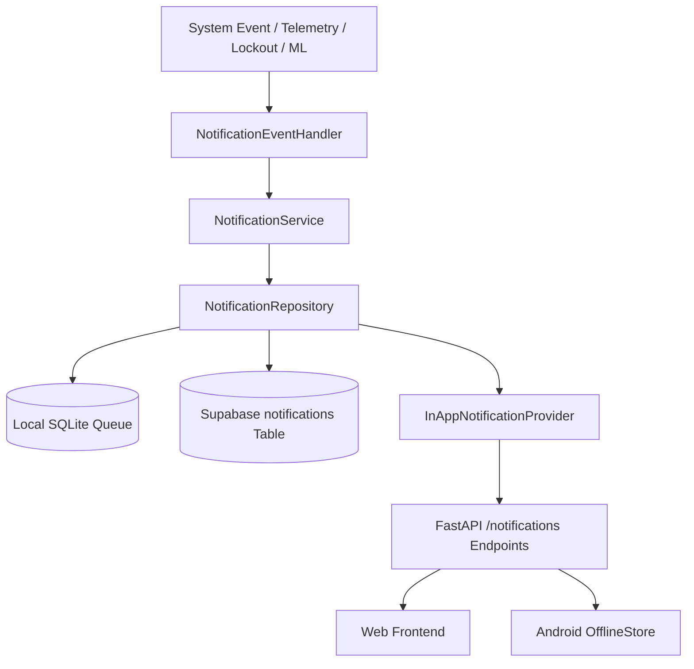

# AgriSaathi Platform — Phase 4 Full Integration Audit

**Document Version:** 1.0.0-PROD  
**Timestamp:** 2026-09-11  
**Scope:** Backend (FastAPI), Frontend (Next.js), Mobile (Android Expo/React Native), Database (Supabase/PostgreSQL/SQLite), IoT/MQTT, Notification Architecture, Actuator Lifecycle, and Security.

---

## 1. Executive Summary

Phase 4 transitions AgriSaathi from isolated model evaluations to an integrated, resilient agricultural operations platform. This audit documents the exact baseline before making code modifications, establishing:
1. Complete inventory of Twilio touchpoints for safe removal.
2. Architecture specification for provider-independent internal notifications with offline queuing.
3. Delta between existing Supabase migrations and required notification/sync schemas.
4. Pump command lifecycle state machine with mandatory Rain Lockout enforcement.
5. Endpoints required for complete Web and Android parity.
6. Web UI reset plan to accommodate user-provided reference designs.

---

## 2. Component Inventory & Baseline Status

| Component | Repository Path | Current Status | Findings & Dependencies |
| :--- | :--- | :--- | :--- |
| **Backend API** | `mlbackend/main.py` | Operational | FastAPI process running on port 8000. Core endpoints active, but missing canonical REST aliases (`/notifications`, `/pump/commands/{id}`, `/farms`, `/zones`, `/devices`). |
| **Authentication** | `mlbackend/auth.py` | Operational | Supabase JWT decoder (HS256) with role validation (`farmer`, `agronomist`, `admin`). Supports dev tokens and strict claims verification. |
| **Database Layer** | `mlbackend/db_layer.py` | Operational | Dual-mode: SQLite (`farm_analytics.db`, `hybrid_farm_edge.db`) + Supabase cloud sync. Has packet deduplication and `client_action_id` idempotency. |
| **MQTT Service** | `mlbackend/mqtt_service.py` | Operational | Topics: `agrisaathi/nodes/ESP32_NODE_01/telemetry`, `commands`, `status`. Retains null values without arbitrary zero substitution. |
| **Actuator Controller** | `mlbackend/pump_controller.py` | Operational | State machine (`requested`, `published`, `acknowledged`, `executed`, `blocked`). Rain Lockout active for rain prob >= 50% or rain >= 5.0mm. |
| **Notifications** | `mlbackend/notification_service.py`, `notification_engine.py` | Mixed | Contaminated with Twilio SMS/Voice API calls. Needs replacement with unified `NotificationService` and persistent database storage. |
| **Model Registry** | `mlbackend/model_registry.py` | Operational | Audited models registered with truth verification labels (`REAL_VERIFIED`, `RULE_BASED`, `EXPERIMENTAL`). |
| **Web Frontend** | `src/` | Cluttered legacy | Next.js 16 (Turbopack) with 21 components. User requested complete UI removal/reset pending reference design images. |
| **Android App** | `android-app/` | Operational | React Native / Expo app with `ApiClient.ts`, `OfflineStore.ts`, and 6 primary screens (`SensorScreen`, `AlertsScreen`, `ChatScreen`, etc.). No direct MQTT connection (complies with security policy). |
| **Supabase Migrations** | `supabase/migrations/20260911_agrisaathi_core.sql` | Migration Ready | Defines 16 core tables, indexes, and RLS policies. Missing dedicated `notifications`, `notification_delivery`, `notification_read_state`, and `offline_sync_events` tables. |

---

## 3. Twilio Audit & Removal Map

Twilio is not required and will be completely excised:

| Target File | Line / Usage | Replacement Strategy |
| :--- | :--- | :--- |
| `package.json` | Line 25: `"twilio": "^5.12.2"` | Remove package dependency; run clean install. |
| `mlbackend/requirements.txt` | Lines 33-34: `# twilio>=9.0.0` | Remove commented reference. |
| `mlbackend/config.py` | Lines 28-31: `TWILIO_ACCOUNT_SID`, `TWILIO_AUTH_TOKEN`, `TWILIO_FROM_NUMBER` | Delete settings fields; remove environment bindings. |
| `mlbackend/main.py` | Lines 171-177: `from .twilio_ivr import router as ivr_router` | Delete Twilio IVR router mount and startup log. |
| `mlbackend/twilio_ivr.py` | Entire file (52 lines) | Delete file entirely. |
| `mlbackend/notification_service.py` | Lines 70-165: `send_twilio_sms()`, `make_twilio_voice_call()` | Remove Twilio functions; route all alerts through the internal `NotificationService`. |
| `mlbackend/test_apis.py` | Lines 4, 30-43: Twilio client import and tests | Remove Twilio test block. |
| `.env.local` / `.env.example` | `TWILIO_*` variables | Remove credentials. |

---

## 4. Internal Notification Architecture

A provider-independent notification system will be implemented:

### Event Types:
1. `RAIN_LOCKOUT_ACTIVATED` (Severity: HIGH)
2. `SOIL_MOISTURE_LOW` (Severity: WARNING)
3. `SOIL_MOISTURE_CRITICAL` (Severity: CRITICAL)
4. `DEVICE_OFFLINE` (Severity: WARNING)
5. `DEVICE_BACK_ONLINE` (Severity: INFO)
6. `PUMP_COMMAND_REQUESTED` (Severity: INFO)
7. `PUMP_COMMAND_BLOCKED` (Severity: HIGH)
8. `PUMP_COMMAND_FAILED` (Severity: HIGH)
9. `PUMP_COMMAND_EXECUTED` (Severity: INFO)
10. `AI_INFERENCE_COMPLETED` (Severity: INFO)
11. `EXPERIMENTAL_MODEL_USED` (Severity: WARNING)
12. `SENSOR_DATA_UNAVAILABLE` (Severity: WARNING)
13. `OFFLINE_SYNC_COMPLETED` (Severity: INFO)
14. `OFFLINE_SYNC_FAILED` (Severity: HIGH)
15. `MODEL_STATUS_CHANGED` (Severity: INFO)

---

## 5. Offline Notification Queue & Sync Specification

### Client Queue Schema:
- `local_id`: UUID
- `server_notification_id`: UUID (nullable)
- `client_action_id`: String (unique idempotency key)
- `notification_type`: String
- `title`: String
- `message`: String
- `severity`: `INFO` | `WARNING` | `CRITICAL` | `HIGH`
- `created_at`: ISO timestamp
- `received_at`: ISO timestamp
- `read_state`: `UNREAD` | `READ`
- `sync_state`: `PENDING` | `SYNCING` | `SYNCED` | `FAILED` | `EXPIRED`
- `retry_count`: Integer
- `last_error`: String (nullable)
- `payload`: JSON object

### Synchronization Lifecycle:
1. Client detects network reconnection.
2. Client authenticates via Supabase JWT.
3. Client posts pending actions to `/notifications/sync` with `client_action_id`.
4. Backend deduplicates by `client_action_id`:
   - If already recorded, returns existing record with `status: "DUPLICATE_ACKNOWLEDGED"`.
   - If new, records in database and marks as `SYNCED`.
5. Client retrieves missed server notifications created since `last_sync_timestamp`.
6. UI displays offline badge when offline and pending sync count.

---

## 6. Supabase Schema Delta

Existing migration: `supabase/migrations/20260911_agrisaathi_core.sql` covers profiles, farms, zones, devices, telemetry, pump commands, alerts, and audit events.

### Required Delta Migration:
`supabase/migrations/20260911_notifications_and_sync.sql`
- Table: `public.notifications`
- Table: `public.notification_delivery`
- Table: `public.notification_read_state`
- Table: `public.offline_sync_events`
- RLS Policies: Authenticated users can read their own notifications; service role inserts/updates; farm/zone ownership validation.

---

## 7. Web UI Reset Plan

Per user request: *"Also remove the existing ui and i will give the refernce pictures for app design"*
1. Replace `src/app/page.tsx` with a clean, high-aesthetic integration landing page:
   - Displays AgriSaathi Core status, backend health, telemetry connection, and awaiting design indicator.
   - Cleanly unmounts the 21 cluttered promo components while maintaining all underlying services (`api.ts`, `aiInferenceService.ts`, `sensorService.ts`, `AuthContext.tsx`).
2. Keep routing and provider hierarchy intact for Next.js 16 Turbopack stability.
